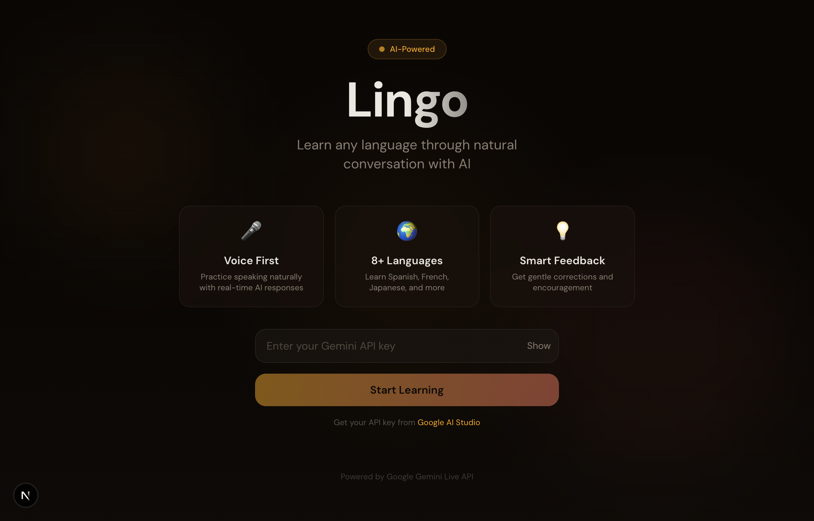

# Lingo - AI-Powered Language Learning

Learn any language through natural voice conversations with AI, powered by Google Gemini's Live API.



## Features

- 🎤 **Voice-First Learning** - Practice speaking naturally with real-time AI responses
- 🌍 **8+ Languages** - Learn Spanish, French, German, Italian, Portuguese, Japanese, Korean, and Chinese
- 💡 **Smart Feedback** - Get gentle corrections and encouragement from your AI tutor
- 🎯 **Adaptive Difficulty** - Conversations adjust to your proficiency level

## Tech Stack

- **Next.js 15** - React framework with App Router
- **TypeScript** - Type-safe development
- **Tailwind CSS** - Utility-first styling
- **shadcn/ui** - Beautiful UI components
- **Google Gemini Live API** - Real-time voice AI conversations

## Getting Started

### Prerequisites

- Node.js 18+
- A Google AI API key (get one at [Google AI Studio](https://aistudio.google.com/apikey))

### Installation

1. Clone the repository:
   ```bash
   git clone https://github.com/yourusername/lingo.git
   cd lingo
   ```

2. Install dependencies:
   ```bash
   npm install
   ```

3. Run the development server:
   ```bash
   npm run dev
   ```

4. Open [http://localhost:3000](http://localhost:3000) in your browser

5. Enter your Gemini API key when prompted

## Usage

1. Select the language you want to learn
2. Click "Start Conversation" to connect to your AI tutor
3. Click and hold the voice orb to speak
4. Release to let the AI respond
5. Practice natural conversations and receive feedback!

## Project Structure

```
src/
├── app/                    # Next.js app router
│   ├── globals.css         # Global styles and theme
│   ├── layout.tsx          # Root layout
│   └── page.tsx            # Main page
├── components/
│   ├── ui/                 # shadcn/ui components
│   ├── ApiKeyInput.tsx     # API key input form
│   ├── ConversationPanel.tsx # Chat transcript display
│   ├── LanguageSelector.tsx  # Language selection
│   ├── VoiceChat.tsx       # Main voice chat interface
│   └── VoiceOrb.tsx        # Animated voice button
├── hooks/
│   ├── useAudioPlayer.ts   # Audio playback hook
│   ├── useAudioRecorder.ts # Microphone recording hook
│   └── useGeminiLive.ts    # Gemini Live API hook
└── lib/
    ├── gemini-live.ts      # Gemini Live API client
    └── utils.ts            # Utility functions
```

## License

MIT
